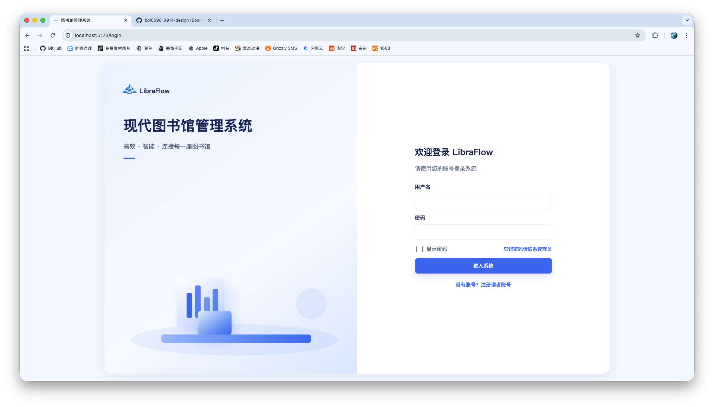

# LibraFlow 现代图书馆管理系统


LibraFlow 是一套面向图书馆真实流通场景设计的全栈管理系统，采用 Spring Boot + MyBatis-Plus + MySQL + Vue 3 技术栈，覆盖读者服务、馆员业务处理、超级管理员系统治理三条主线。

它不是一个只有 CRUD 的空壳后台，而是围绕“馆藏资源、借阅流转、逾期罚款、权限配置、系统审计”构建的完整图书馆业务闭环。

## 核心亮点

- 三角色权限模型：读者、图书管理员、超级管理员分层访问。
- 完整借阅链路：检索、借阅、续借、还书、逾期、罚款处理。
- 馆藏运营能力：图书新增、编辑、删除、上下架、库存维护。
- 系统治理能力：管理员管理、借阅规则配置、操作日志查看。
- 前后端分离架构：Vue 3 前端 + Spring Boot REST API。
- JWT 无状态认证：适合后台管理系统和移动端扩展。
- 现代化 UI：LibraFlow 品牌视觉、角色化导航、登录注册页面、响应式布局。

## 项目截图

### 登录页面



### 读者工作台


### 图书管理员工作台


### 超级管理员工作台


## 技术架构

```text
LibraFlow
├── frontend                 # Vue 3 + Vite 前端应用
│   ├── src/api              # Axios API 封装
│   ├── src/router           # 路由与角色守卫
│   ├── src/stores           # Pinia 登录态
│   └── src/views            # 业务页面
├── backend                  # Spring Boot 后端服务
│   ├── controller           # REST 接口
│   ├── service              # 业务逻辑
│   ├── mapper               # MyBatis-Plus Mapper
│   ├── security             # JWT 与权限控制
│   └── resources/db         # 数据库脚本
├── docs/images              # README 展示截图
└── backups                  # 本地备份文件
```

## 功能模块

### 读者端

- 账号登录、读者注册、个人资料维护、密码修改
- 图书检索、分类查询、馆藏信息浏览
- 在线借阅、续借、归还申请入口
- 当前借阅、历史借阅、到期提醒
- 逾期天数、罚款明细、系统公告与通知

### 图书管理员端

- 图书新增、编辑、删除、上下架、库存维护
- 分类、标签、出版社等基础资料维护
- 线下借书、还书、人工续借
- 逾期登记、罚款处理、缴费核验
- 读者账号查看、异常账号限制
- 读者反馈处理与基础数据统计

### 超级管理员端

- 管理员新增、禁用、权限分配入口
- 借阅时长、续借次数、逾期收费规则配置
- 图书、读者、借阅记录全量管理
- 数据导入导出、备份恢复入口
- 系统日志、操作记录、全局公告配置

## 快速启动

### 1. 初始化数据库

```bash
mysql -uroot -p123456 < backend/src/main/resources/db/schema.sql
```

### 2. 启动后端

```bash
cd backend
mvn spring-boot:run
```

后端默认地址：

```text
http://localhost:8080/api
```

### 3. 启动前端

```bash
cd frontend
pnpm install
pnpm dev
```

前端默认地址：

```text
http://localhost:5173/
```

## 构建验证

```bash
cd backend && mvn -q -DskipTests package
cd frontend && pnpm build
```

## 设计说明

- 登录页不默认填充账号，支持读者自助注册。
- 读者端聚焦资源检索和个人借阅，不展示冗余全局搜索。
- 馆员与超级管理员保留全局搜索，便于按书名、ISBN、条码和读者证号快速定位。
- 顶部通知为真实可点击交互，角色不同展示不同通知内容。
- 前端品牌 logo、favicon、侧边栏导航、登录页视觉均已统一为 LibraFlow 风格。

## 开发说明

- 默认数据库连接配置位于 `backend/src/main/resources/application.yml`。
- 权限控制位于 `backend/src/main/java/com/example/library/security`。
- 前端路由守卫位于 `frontend/src/router/index.js`。
- `frontend/package.json` 使用 `@rollup/wasm-node` 覆盖 Rollup 原生包，以避开部分 macOS/Node 环境中的原生二进制签名问题。
