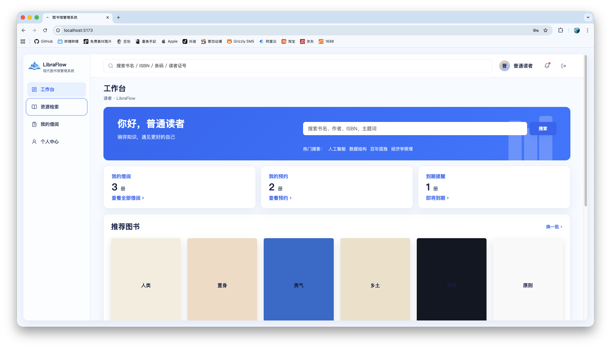
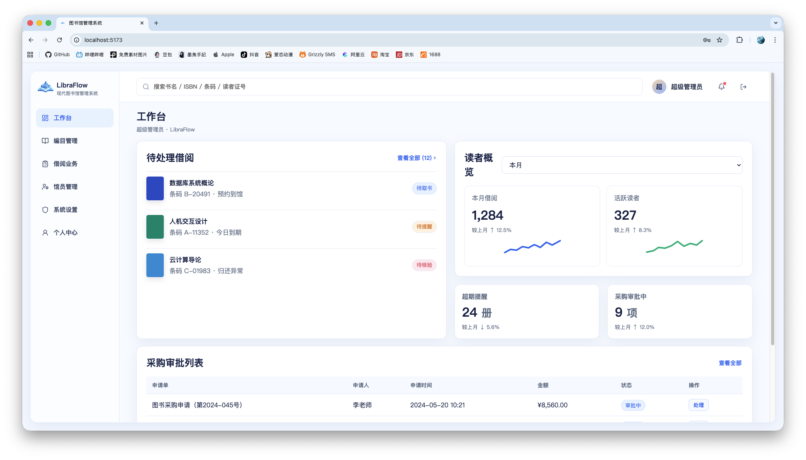

# LibraFlow 图书馆管理系统

LibraFlow 是一个基于 Spring Boot、MyBatis-Plus、MySQL 和 Vue 3 的现代图书馆管理系统，覆盖读者、图书管理员、超级管理员三类角色，适合作为课程设计、毕业设计或后台管理系统项目模板。

## 项目截图

### 读者工作台



### 图书管理员工作台


### 超级管理员工作台


### 通知交互



## 技术栈

- 后端：Spring Boot 3.3、Spring Security、JWT、MyBatis-Plus、MySQL
- 前端：Vue 3、Vite、Pinia、Vue Router、Axios、Lucide Icons
- 数据库：MySQL，默认本地连接配置位于 `backend/src/main/resources/application.yml`
- 构建工具：Maven、pnpm

## 功能模块

### 读者

- 登录、注册、修改个人资料、修改密码
- 图书检索、分类查询、馆藏详情浏览
- 图书借阅、线上续借、归还申请入口
- 查看在借图书、历史借阅记录
- 查看逾期天数、罚款明细
- 查看系统公告和个人通知

### 图书管理员

- 图书新增、编辑、删除、上下架、库存维护
- 分类、标签、出版社等基础资料管理
- 线下借书、还书、人工续借
- 逾期管理、罚款登记、缴费处理
- 读者信息查看、异常账号限制
- 基础数据统计、读者反馈处理

### 超级管理员

- 新增、禁用管理员账号
- 管理借阅时长、续借次数、逾期收费规则
- 图书、读者、借阅记录全量管理
- 数据批量导入导出、备份恢复入口
- 系统日志、操作记录查看
- 首页公告与系统全局配置

## 本地运行

### 1. 初始化数据库

```bash
mysql -uroot -p123456 < backend/src/main/resources/db/schema.sql
```

### 2. 启动后端

```bash
cd backend
mvn spring-boot:run
```

后端接口地址：

```text
http://localhost:8080/api
```

### 3. 启动前端

```bash
cd frontend
pnpm install
pnpm dev
```

前端访问地址：

```text
http://localhost:5173/
```

## 构建验证

```bash
cd backend && mvn -q -DskipTests package
cd frontend && pnpm build
```

## 目录结构

```text
.
├── backend                  # Spring Boot 后端
├── frontend                 # Vue 3 前端
├── docs/images              # README 截图
├── backups                  # 本地数据库和项目备份
└── README.md
```

## 说明

- 登录页默认不填充账号，支持读者自助注册。
- 前端已按角色区分导航与顶部搜索：读者端保留首页检索区，后台角色保留全局搜索。
- `frontend/package.json` 使用 `@rollup/wasm-node` 覆盖 Rollup 原生包，以避开部分 macOS/Node 环境中的原生二进制签名问题。
